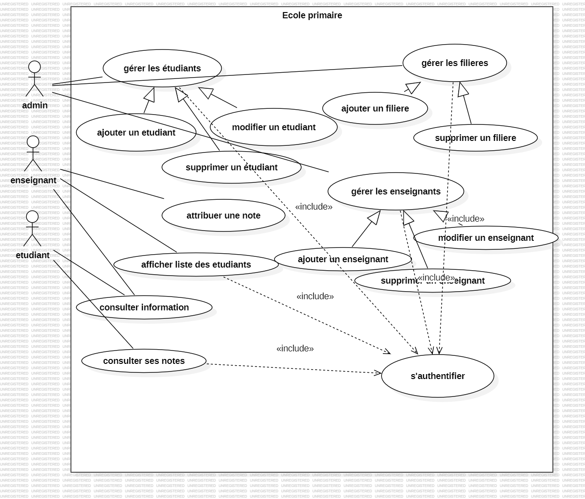
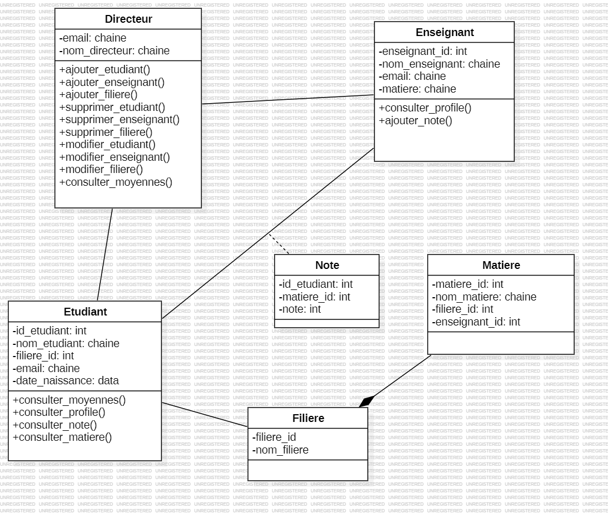

# Ecole Primaire

## Project Overview

Hello! I'm **Haydar Abessi**, aka **Hyzr**, and this is my project called **Ecole Primaire**. It's a school management system designed to help teachers and administrators manage student information, grades, and other academic details. The project focuses on creating a user-friendly and efficient interface for educators to track and maintain data on student performance.

## Features and Capabilities

- **Student Management**: Teachers can add, edit, and remove student records.
- **Grade Management**: Teachers can assign grades to students, and the system tracks academic performance.
- **User Roles**: The system includes multiple roles, such as teachers, administrators, and students, each with distinct permissions.
- **Teacher Dashboard**: Provides teachers with a clear view of their students' grades and progress.
- **Data Export**: Ability to export grades and student details for reporting and analysis.
- **User Authentication**: Role-based access to ensure proper security and data protection.

## UML Diagrams

Here is the **Use Case Diagram** for the system, which shows the different interactions between the users and the system:

Here is the **Class Diagram** for the system, which shows the different interactions between the users and the system:

